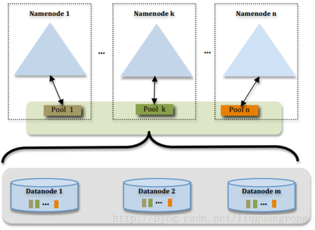

#### Hadoop 2.x 的产生背景

 Hadoop 1.0 中 HDFS 和 MapReduce 在高可用、扩展性等方面存在问题。 

> NameNode 存在的问题

- NameNode 单点故障，难以应用于在线场景 
- NameNode 压力过大，且内存受限，影响系统扩展性 

> MapReduce 存在的问题 

-  JobTracker 访问压力大，影响系统扩展性 
-  难以支持除 MapReduce 之外的计算框架，比如 Spark、Storm 等.

##### Hadoop 2.x 由 HDFS，MapReduce ，YARN 三部分组成

- HDFS 分布式文件存储系统
- YARN 资源管理系统
- MapReduce 运行在 YARN 上的计算框架
- 架构图

#### Hadoop 2.x  HA 原理

##### JournalNode 角色

- 基本原理就是用 2N+1 台服务器( JN )存储 Editlog，每次写入数据的时候，有超过一半的 JN 写入成功，就认为是成功的数据就不会丢失了。

- 在HA架构里面SecondaryNameNode这个冷备角色已经不存在了，为了保持standby NN时时的与主Active NN的元数据保持一致，他们之间交互通过一系列守护的轻量级进程 JournalNode

- 任何修改操作在 Active NN 上面执行时，JN进程同时也会记录修改log到至少半数以上的JN中 ，这个时候 standby NameNode 检测到了 editlog 的变化，就会立刻读取 JN 里面的editlog，如何同步到自己的目录镜像树里面去，如图：

  

- 当发生故障时候，Active NameNode 挂掉后，Standby NamnNode ，会在它成为 ActiveNameNode前

  读取所有的 JN 里面的修改日志，这样就能高可靠的保证与挂掉的NameNode目录镜像树一样，然后无缝的接替它的职责，维护来自客户端请求，从而达到一个高可用的目的

---

##### ZKFailoverController 角色 （这不是单独的节点，这是NameNode上面的一个进程，自动会配置）

ZKFailoverController 主要包括 3 个组件

- HealthMonitor: 监控NameNode是否处于unavailable或unhealthy状态。当前通过RPC调用NN相应的方法完成
- ActiveStandbyElector: 管理和监控自己在ZK中的状态
- ZKFailoverController 它订阅HealthMonitor 和ActiveStandbyElector 的事件，并管理NameNode的状态

##### ZKFailoverController 的主要职责

- 健康监测：周期性的向它监控的NN发送健康探测命令，从而来确定某个NameNode是否处于健康状态，如果机器宕机，心跳失败，那么zkfc就会标记它处于一个不健康的状态 
- 会话管理：如果NN是健康的，zkfc就会在zookeeper中保持一个打开的会话，如果NameNode同时还是Active状态的，那么zkfc还会在Zookeeper中占有一个类型为短暂类型的znode，当这个NN挂掉时，这个znode将会被删除，然后备用的NN，将会得到这把锁，升级为主NN，同时标记状态为Active 
- 当宕机的NN新启动时，它会再次注册zookeper，发现已经有znode锁了，便会自动变为Standby状态，如此往复循环，保证高可靠，需要注意，目前仅仅支持最多配置2个NN
- master选举：如上所述，通过在zookeeper中维持一个短暂类型的znode，来实现抢占式的锁机制，从而判断那个NameNode为Active状态

---

##### Federation 联邦机制 （最开始的架构图，没有体现）

==多个 Active NameNode ,Standby NameNode 对==

- 单 Active NameNode 的架构使得 HDFS 在集群扩展性和性能上都有潜在的问题，当集群大到一定程度后，NameNode 进程使用的内存可能会达到上百G，NameNode 成为了性能的瓶颈
- 常用的估算公式为1G对应1百万个块，按缺省块大小计算的话，大概是64T (这个估算比例是有比较大的富裕的，其实，即使是每个文件只有一个块，所有元数据信息也不会有1KB/block)
- 为了解决这个问题,Hadoop 2.x 提供了HDFS Federation, 示意图如下：  

- 多个 NameNode 公用一个集群里面的 DataNode，每个 NameNode 都可以单独对外提供服务 

- 每个 NameNode 都会定义一个存储池，有单独的id，每个 DataNode 都为所有存储池提供存储

- DataNode 会按照存储池的 ID 向其对应的 NameNode 汇报块信息，同时 DataNode会向所有的 NameNode汇报本地存储的可用资源情况

- 如果需要在客户端方便的访问若干个 NameNode 上的资源，可以使用客户端挂载表，把不同的目录映射到不同的 NameNode ，但 NameNode 上必须存在相应的目录

- 设计优势

  - 改动最小，向前兼容；现有的 NameNode 无需任何配置改动；如果现有的客户端只连某台NameNode  

    的话，代码和配置也无需改动

  - 分离命名空间管理和块存储管理

  - 客户端挂载表：通过路径自动对应 NameNode 、使Federation的配置改动对应用透明