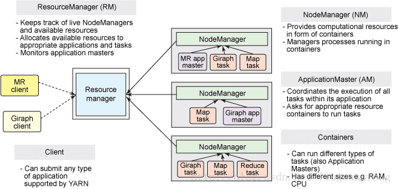

### Yarn 基本原理

[参考链接](https://blog.csdn.net/bingduanlbd/article/details/51880019)

YARN（Yet Another Resource Negotiator）是一个**通用**的资源管理平台，可为各类计算框架提供资源的管理和调度。  其核心出发点是为了分离资源管理与作业调度/监控，实现分离的做法是拥有一个全局的资源管理器（ResourceManager，RM），以及每个应用程序对应一个的应用管理器（ApplicationMaster，AM），应用程序由一个作业（Job）或者Job的有向无环图（DAG）组成。 

#### 架构

YARN可以将多种计算框架(如离线处理MapReduce、在线处理的Storm、迭代式计算框架Spark、流式处理框架S4等) 部署到一个公共集群中，共享集群的资源。并提供如下功能： 

- 资源的统一管理和调度：

  集群中所有节点的资源(内存、CPU、磁盘、网络等)抽象为Container。计算框架需要资源进行运算任务时需要向YARN申请Container， YARN按照特定的策略对资源进行调度进行Container的分配。 

- YARN使用了轻量级资源隔离机制Cgroups进行资源隔离以避免相互干扰，一旦Container使用的资源量超过事先定义的上限值，就将其杀死。 

---

YARN  总体上是Master/Slave结构，主要由ResourceManager、NodeManager、 ApplicationMaster和Container等几个组件构成。 

> ###### ResourceManager  资源管理器

负责对各 **NodeManager** 上的资源进行统一管理和调度 ，根据各个**NodeManager** 上的资源情况来选择在那个 **NodeManager** 启动 AppiclationMaster

> ###### NodeManager 节点管理器

**NodeManager**  是每个节点（DataNode）上的资源和任务管理器。它会定时地向ResourceManager汇报本节点上的资源使用情况和各个Container的运行状态；同时会接收并处理来自**ApplicationMaster**  的Container 启动/停止等请求。 

> ##### ApplicationMaster

用户提交的应用程序均包含一个ApplicationMaster，负责应用的监控，跟踪应用执行状态，重启失败任务等。

向 ResourceManager 汇报情况等等

> ##### Container

Container是YARN中的资源抽象，它封装了某个节点上的多维度资源，如内存、CPU、磁盘、网络等

#### Yarn 应用工作流程

- client 提交任务后，会联系 ResourceManager ，要求它启动一个 ApplicationMaster 

- ResourceManager 收到用户请求后，会根据每个 NodeManager 上的资源使用情况来选择一个节点。

- 然后会启动该节点上的 ApplicationMaster ，然后 ApplicationMaster 会看这个任务需要的数据是否在当前节点上，如果在就向 ResourceManager 申请资源，然后 ResourceManager  就会向 NodeManage 发送命令，让它在节点上创建一个 container ，然后 ApplicationMaster 会让 NodeMange 启动具体的任务，启动后，execute 会监视任务的进度，以及资源使用情况，并且会向 ApplicationMaster  反向注册，同时 ApplicationMaster 也会向 ResourceManager 汇报任务进度，资源情况等等

  如果 需要的数据不在当前节点（因为最开始选择 NodeManager 的时候，是根据资源情况选择的）的话，那么 ApplicationMaster 就会连接有数据的那个节点，然后会向 ResourceManager 申请资源，然后 ResourceManager 会命令 NodeManage 创建一个 Container，然后 ApplicationMaster 会让 NodeMange 启动具体的任务。然后其他步骤和上面的一样

  

