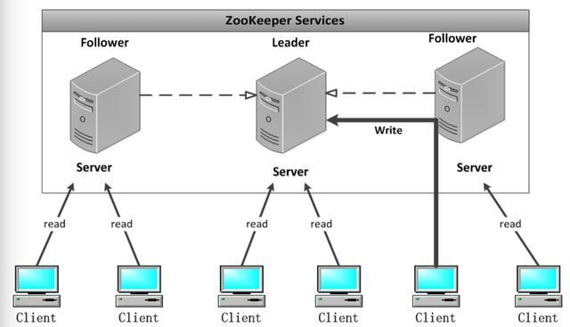

#### zookeeper 原理

 ZooKeeper是一个分布式的，开源的分布式应用程序协调服务，是 Google 的 Chubby一个开源的实现，是Hadoop和Hbase的重要组件。 

它是一个为分布式应用提供一致性服务的软件，提供的功能包括：配置维护、域名服务、分布式同步、组服务等。 
ZooKeeper：提供通用的分布式锁服务，用以协调分布式应用。

##### zookeeper 角色

zookeeper 中有三个角色，Leader , Follow , Observer 这么3个角色，通过一次选举过程，被选举的机器节点被称为Leader，Leader机器为客户端提供读和写服务； 

- 领导者（leader）负责进行投票的发起和决议，更新系统状态。 ( 并不是投票谁当 leader，是投票其他事情)
- （学习者），包括跟随者（follower）和观察者（observer），follower用于接受客户端请求并想客户端返回结果，在选主过程中参与投票。
- Observer 可以接受客户端连接，将写请求转发给leader，但observer不参加投票过程，只同步leader的状态，observer的目的是为了扩展系统，提高读取速度。 

 ##### 节点读写服务分工 

- ZooKeeper 集群的所有机器通过一个 Leader 选举过程来选定一台被称为『Leader』 的机器，Leader服务器为客户端提供读和写服务。 
- Follower 和 Observer 都能提供读服务，不能提供写服务。两者唯一的区别在于， Observer机器不参与 Leader 选举过程，也不参与写操作的『过半写成功』策略，因 此 Observer 可以在不影响写性能的情况下提升集群的读性能。 

==如果Leader挂了，那么就会选举新的leader==

##### zookeeper 和 NameNode

Zookeeper 可以控制，始终只有一个 Active NameNode ,当一个 Active NameNode 挂了后，立马会由 leader ，

把另一个 standby NameNode，提升为 ActiveNameNode，

