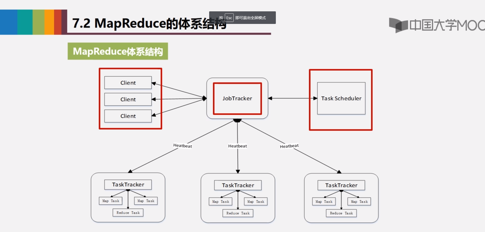
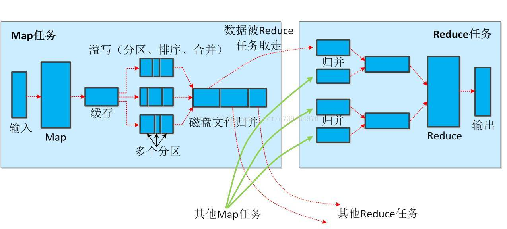
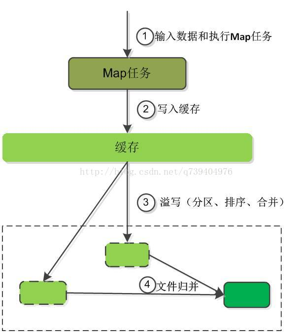
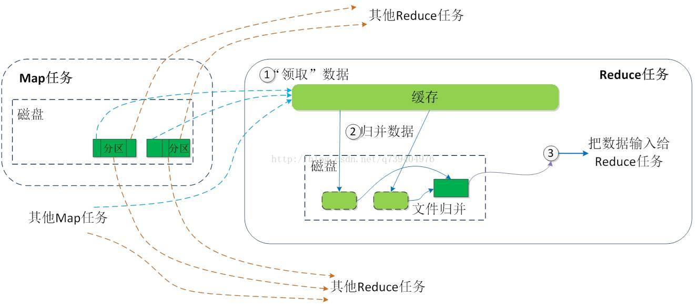

#### MapReduce 介绍

[超详细过程](https://blog.csdn.net/q739404976/article/details/73188645)

MapReduce 是一种分布式的离线计算框架，是一种计算框架，用于大规模的数据采集（大于1TB）的并行运算。

将自己的程序运行再分布式的系统上。概念是 Map（映射）和 Reduce（规约）

指定一个 Map 函数，用来把一组键值对映射成一组新的键值对，指定并发的 Reduce(规约)函数，用来保证所有映射的键值对中的每一个共享相同的键组

可以用于大规模的算法图形处理，文字处理

#### MapReduce 的设计理念

1. 分布式计算

   分布式计算将该应用分解成多个小的部分，分配给多台计算机节点进行处理，这样可以节约整体的计算时间，大大提高计算效率

2. 移动计算，而不是移动数据

   将计算程序应用移动到具有数据的集群计算机节点上进行计算操作，而不是把数据呐过来

#### MapReduce 计算框架的组成（概览）

主要有这么几个阶段

- 输入数据

这个输入数据就是，每一个 DataNode 上面的 block 块

- 拆分 （splits） 

一个分片对于着一个 map 任务

输入到 MapReduce 的数据，首先被切分成固定大小的片段叫做 input splits ，一个片段对应着一个 map

==一般来说会把一个 block 当作一个 片段，但是细粒度的分片，将会有更好的负载均衡==

- 映射（Mapping） 给它一堆键值对，输出新的键值对

==map的数量就是上面分段的数量==   ==maping是在有数据 DataNode 上面跑==

这是我们的 MapReduce 程序执行的第一个个阶段，在这个阶段中，传递给 map 的片段里面的数据，就会被映射成键值对，比如 计算（某个单词出现的个数），具体是什么键值对，就由我们具体的代码实现。

这里有一个缓存区的概念，每次 map输出的东西会先保存到缓存区里面，当缓冲区超过80%后，就会缓冲区里面的数据写到磁盘里面（不是 HDFS），然后缓冲区继续使用，当map跑完以后，就会把缓冲区文件合并

- 混洗 （shuffle）(排序分组)

==shuffle 是在 map和reduce中间的一个阶段，可以把它归为reduce阶段==

shuffle 可以把 map 阶段输出的值，按照某种 key 值，重新的排序和组合（比如把相同的东西放到一起），把key值符合某种范围的输出送到特定的reduce那里去处理

它可以简化 reduce 的过程

我们把排序归于 map，我们把组合归于 reduce

#### 输入与输出

- Map 阶段

输入 <key,value>    <'行号','a b c'>

输出 <newkey, newvalue>   <a,1>  <b,1>  <c,1>

- reduce 阶段

输入 <key, value-list>   <a,

输出 <key, value>

#### Mapreduce 体系架构

采用的是主从架构 master/slave

##### client 客户端

- 通过 client 可以提交用户编写的应用程序，通过它将应用程序提交到 JobTracker (ResourceManager)
- 用户可以通过 client 提供的接口，查询到当前作业的运行状态  （我们提交的应用程序会被表现为作业的形式），一个作业通常有多个 task

##### JobTracker 作业跟踪器 ( ResourceManager ) （主 master ）

- 负责资源的监控和作业的调度
- 监控底层的其他的 task tracker 以及当前运行的 job 的健康状态
- 一旦探测到失败的情况，就把这个任务转移到其他的节点上继续执行，跟踪任务的执行进度和资源使用量（appMaster 汇报的 ），

##### TaskTracker 任务调度器 （NodeManage） （从 slave）

- 执行具体的相关任务，一般接收 JobTracker 发送的命令
- 把自己的一些资源使用情况，以及任务的运行进度通过心跳的方式，也就是 heartbeat发送给 JobTracker

##### Task 任务

map 任务：map 函数

reduce 任务：reduce 函数

#### combiner 函数 (map 端的 reduce) 合并

==合并是多个数据变成一个数据==

==归并是多个分散的数据，变成一个列表==

集群上的可用宽带限制了 MapReduce 作业的数量，因此尽量避免 map 和reduce任务之前数据传输是有利的。

Hadoop 允许用户针对map任务的输出指定一个combiner，combiner 函数的输出作为reduce函数的输入。

combiner 是 map 和 reduce 的一个中间过程。假设有一个求最高气温的例子，由两个map处理。

假设第一个map的输出如下：

(1950,0)

(1950,20)

(1950,10)

第二个map的输出如下:

(1950,25)

(1950,15)

reduce 函数被调用时，输入如下

（1950，[0,20,10,25,15])

因为 25 时这个列表中最大的，所以它的输出如下。

(1950,25)

我们可以像使用reduce函数那样，使用 combiner 找出每个 map 任务的最高气温，如此一来，reduce 函数，输入的数据将是 （这里是多个map的溢写文件，进行归并merge）

(1950,[20,25])

reduce 输出的结果和以前一样。

但是并不是所有的函数都可以经过 combiner ，比如平均值就不行。

combiner 函数不能取代 reduce 函数，但是 combiner 可以帮助我们减少 map 和 reduce 之间的数据传输量。

就这个点而言，我们是否使用 combiner 时值得斟酌的。

#### MapReduce 完整过程

https://blog.csdn.net/q739404976/article/details/73188645

> Map 阶段 和 shuffle 前阶段

==排序和 combiner（合并）可以理解为 shuffle的前以部分==

block 块进来以后，会对块进行分片，分片大小，默认是块大小。就是说默认是一个分片。

然后一个分片对应一个 map task 。分片的数据经过 map 阶段处理，输出，这里的输出是先会输出到一个环形的内存缓冲区中，默认大小是100MB，当内存缓冲区中的数据达到 80% 后，就会启动一个线程把数据写入磁盘 ，在写入磁盘之前，会对内存中的结果分区、排序、如果有 combiner ，就需要 combiner（分组）。

分区是利用对key进行hash，把hash后结果一样的放在一个分区内。hash函数有好多中，这是一个取模的hash函数.

内部是  num % reduce-num ，就是把 key 转化为数字，然后除以reduce的数量，然后求余数。

在把内存中的数据写入磁盘的时候，如果内存被填满了，那么内存就不会再写入新数据，就会阻塞，直到数据写入磁盘完成。

每一个溢写后的文件，也是经过分区了的，在所有的 map 任务完成之前，就会进行 merge（归并 ）的操作，就是把所有溢写文件，归并成一个大文件。这个大文件也是分区了的。

> shuffle 后阶段和 Reduce 阶段

Reduce 然后会通过RPC的方式向 JobTracker 询问任务是否已经完成，如果完成了，就会领取数据。

一个 reduce 可以领取来自多个 map 上的数据，但是只领取map上的一个分区，就是对应着 map 最后那个大文件的一部分（某个分区）。其他的分区，由其他的reduce领取。

reduce 领取的文件，先放入内存，那些来自不同map的数据，先归并（merge），再合并（combiner），然后溢写到磁盘。然后多个溢写文件，合并成一个大文件，然后再给 reduce 处理。

当数据很少的不需要溢写到磁盘，直接到内存中，归并、合并、再输出给  reduce