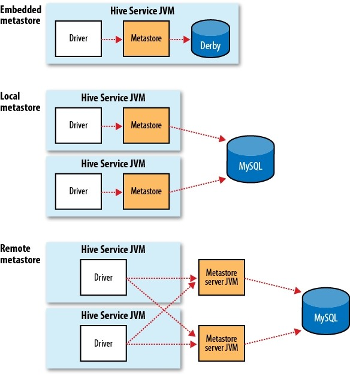

### Hive 各种服务

Hive内部自带了许多的服务，我们可以在运行时用--service选项来明确指定使用什么服务，如果你不知道Hive内部有多少服务，可以用下面的--service help来查看帮助。

```sh
Service List: 
beeline 
cli 
help 
hiveburninclient 
hiveserver2 
hiveserver 
hwi 
jar 
lineage 
metastore 
metatool 
orcfiledump 
rcfilecat 
schemaTool 
version
```

- ==cli==这个就是Command Line Interface的简写，是Hive的命令行界面，用的比较多。这是默认的服务，直接可以在命令行里面使用。 (服务器和客户都在一起)

- ==hiveserver==这个可以让Hive以提供Trift服务的服务器形式来运行，可以允许许多不同语言编写的客户端进行通信。使用需要启动HiveServer服务以和客户端联系，我们可以通过设置HIVE_PORT环境变量来设置服务器所监听的端口号，在默认的情况下，端口为10000。（服务端）

- ==HiveServer2== 是一个能使客户端针对hive执行查询的一种服务，与HiverServer1比较，它能够支持多个客户端的并发请求和授权的，这个允许我们使用各种编程语言操作 Hive。（服务端）

- ==beenline== 是一个用来连接 HiveServer2 的客户端。（服务端）

- ==hwi== 其实就是hive web interface的缩写，它是Hive的Web接口，是 hive cli的一个web替换方案。 (服务端和客户都一起)

- ==metastore== 在默认情况下，metastore和Hive服务运行在同一个进程中（如下图介绍）。使用这个服务，可以让metastore作为一个单独的进程运行，我们可以通过METASTORE_PORT来指定监听的端口号。 

  （这个是一个单独的进程。）

  

