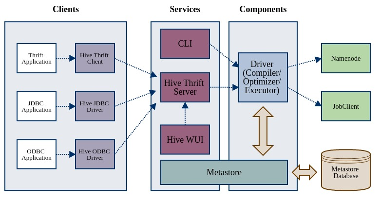

### Hive 架构

[参考链接](https://blog.csdn.net/yanshu2012/article/details/54944943)

Hive是典型C/S模式。Client端有JDBC/ODBC Client 和 Thrift Client 两类。Server 端则分为如下几个部分： 

- CLI 
- WUI 
- Thrift Server
- Metastore （Components）
- Driver （Components）

其他资料要么吧Hive架构分为Client/Services 两个部分，要么全部称为组件。为了更好地理解Hive，我重新调整一下组织结构，如上图所示。Hive的模块分为： 

- Clients：远程访问Hive的应用客户端；
- Services：需要独立部署的Hive服务；
- Components：独立功能的Hive组件。

---

### Clients 客户端

#### Thrift Client

Thrift客户端采用Hive Thrift Server提供的接口来访问Hive。官网已经公开了Thrift服务的RPC，有兴趣的同学可以了解一下。 

如果不想重新编写Thrift客户端，Hive 也提供了封装好 Thrift RPC 的 Python Client 和 Ruby Client。 

==Thrift Client的优点在于，程序员不再依赖Hive环境来访问Hive数据仓库。==

#### JDBC Client

Hive官方已经实现了JDBC Driver（hive-jdbc-*.jar）。如果你希望通过Java访问Hive，请参照官网JDBC Client Sample Code。 

Hive 0.14以后，Hive将自带的Beeline重构成一个命令行界面的JDBC Client。之前，Beeline类似于Hive CLI的运行模式。 

==Beeline解决了CLI无法避免的并发访问冲突。==

#### ODBC Client

目前Hive暂没有提供ODBC Driver支持。 

---

### Services 服务端

#### CLI（命令行界面）

CLI 是客户端和服务端一起的方式，你只需要在一个具备完整Hive环境下的Shell终端中键入`hive`即可启动服务。 

我们之所以将CLI归为Services，是因为它可以直接调用Driver来工作。不妨把CLI看成一个命令行界面的单机版Hive服务，用户可以在CLI上输入HQL来执行创建表、更改属性以及查询等操作。不过Hive CLI不适应于高并发的生产环境，仅仅是Hive管理员的好工具。 

==优点：简单快捷，容易上手==

#### Hive Thrift Server

Hive Thrift Server 是基于 Thrift 软件框架开发的，它提供 Hive 的RPC通信接口。目前的HiveServer2(HS2)较之前一版HiveServer，增加了多客户端并发支持和认证功能，极大地提升了Hive的工作效率和安全系数。 

在运维HS2的时候，我们还需要注意以下一些细节：

- HS2启动加载hive-site.xml文件配置时，只会加载HS2相关参数。也就是说，你在hive-site.xml里面设置的Hive任务参数并不会对Clients生效；
- Hive Clients的用户权限取决于启动HS2进程的用户；
- 利用hive.reloadable.aux.jars.path参数可以不用重启HS2而热加载第三方jar包（UDF或SerDe）

#### WUI （Web User Interface）

WUI并不属于Apache Hive，它是Hive生态圈的一项服务，目前熟知的有Karmasphere、Hue、Qubole等项目。WUI是B/S模式的服务进程，Server一端与Hive Thrfit Server交互，Brower一端供用户进行Web访问。 

目前绝大多数的数据分析公司都采用了Cloudera公司的开源项目Hue作为Hive WUI。后续文章也会着重提及Hue的运维，本文不做详细解说。有关Hue的内容大家可以详见Hue官网。

---

### Components 组件

#### Driver 

Driver在很多Hive架构描述里都划分到Services中，这给我初入Hive带来了一些困扰。我认为Driver并不是服务，而是在输入HQL后才会被调用的一项组件，在这里将其归纳到Components部分。每一个Hive服务都需要调用Driver来完成HQL语句的翻译和执行。通俗地说，Driver就是HQL编译器，它解析和优化HQL语句，将其转换成一个Hive Job（可以是MapReduce，也可以是Spark等其他任务）并提交给Hadoop集群。 

#### Metastore

Metastore 是Hive元数据的存储地。在功能上Metastore分为两个部分：服务和存储，也就是架构图中提到的Metastore及其Database。 

