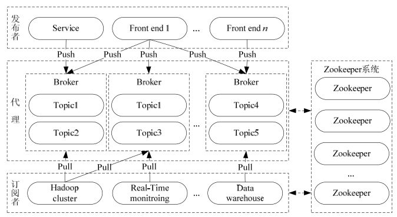
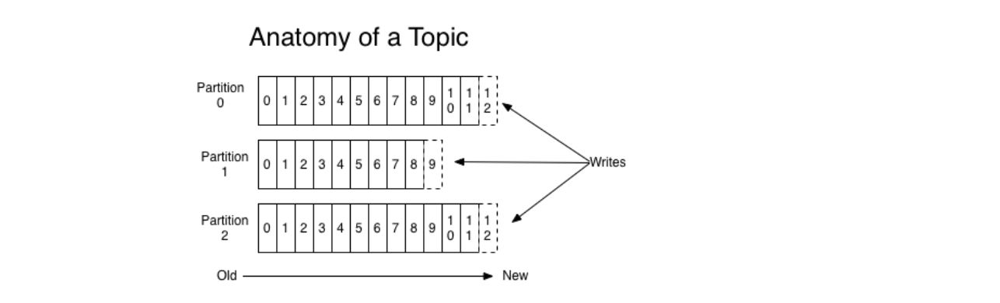

#### Kafka 基本原理

Kafka是一个分布式流处理平台 

==Kafka 是一个分布式的，可分区的，可复制的消息发布和订阅的系统，具备高性能高吞吐率。==

---

#### Kafka 消息队列的特点

- 生产者消费者模式
- FIFIO (先进先出)的有序性 ，新数据总是从每个分区的结尾添加，不会从中间插入
- 是分布式的
- 高吞吐率的
- 消息被处理的状态是在 consumer 端被维护，而不是由 server 端维护，当失败时，可以自动平衡

#### 名称解释

> Topic (主题)

我们把一类消息成为一个主题，一个主题被拆分成分区，可以是一个分区，也可以是多个分区。

 每个这样的分区包含不可变有序序列的消息。 分区被实现为具有相等大小的一组分段文件。  

> Partition （分区）

- 一个主题可以有多个分区
- 每个分区内部的消息有序，其中每个消息都有一个在当前分区中 唯一的 offset
- 分区在 broker 中，一个 broker 中可以有多个分区。一个broker就是一个kafka服务器
- 分区的数量，是在创建 topic 时候指定的
- 所谓的分区内的消息强有序，指定就是，里面保持了一个先后顺序，先来的在前面，后来的在后面。

> Partition offset（分区偏移）  

每个分区内部，消息的唯一编号，称为 offset

> Replicas of partition（分区备份）

副本只是一个分区的备份。 副本从不读取或写入数据。 它们用于防止数据丢失。  

> Broker （经纪人）

就是 kafka 服务器，多个 broker 构成一个集群

> Kafka Cluster （Kafka 集群）

Kafka 有多个代理称为Kafka集群。可以扩展Kafka集群，无需停机。 这些集群用于管理消息数据的持久性和复制。 

> Producers （生产者）

生产者是发送主题给 kafka 的消息发布者。生产者向 Kafka 经纪人发送数据，每当生产者将消息发给代理（kafka服务器）时，代理只需要将消息附加到最后一个段文件。实际上，该消息将被附加到分区。生产者还可以向他们选择的分区发送消息。  

> Consumers （消费者）

Consumers 从kafka服务器（brokers）读取数据。消费者可以订阅一个或者多个主题，并通过从代理中提取数据来使用已经发布的消息。

- Consumer 自己维护已经消费到了哪个 offset
- 每个 consumer 都有对应的 group
- 一个 group 里面有一个或者多个 consumer
- group 内时queue 消费模型，每个 consumer消费不同的分区，因此一个消息在group内消费一次。
- group间是publish-subscribe消费模型：各个group各自独立消费，互不影响，因此一个消息被每个group消费一次。