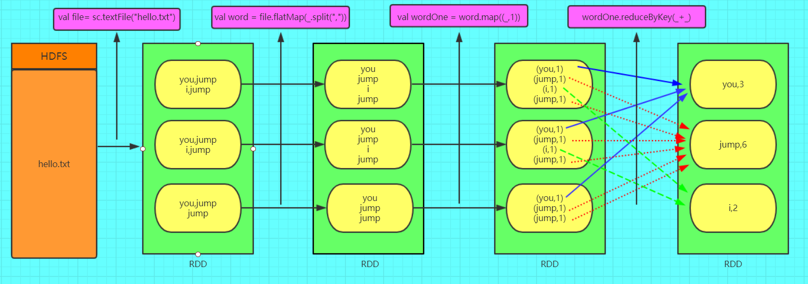
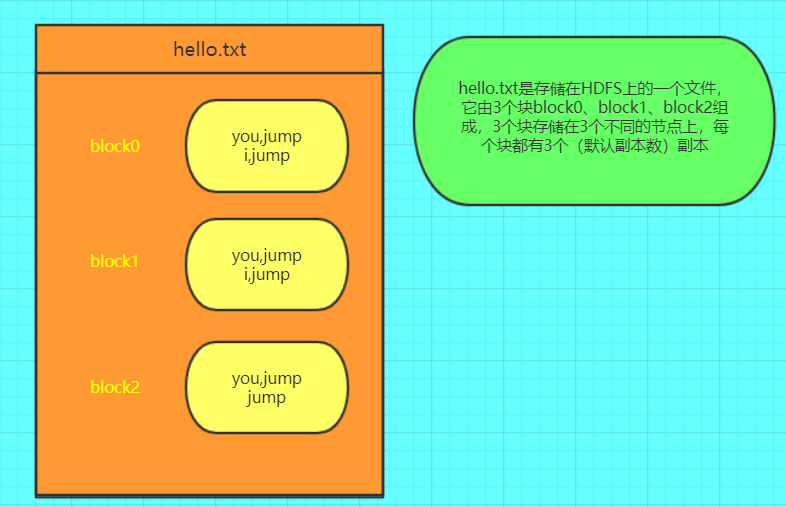

### Spark 基本原理

[参考链接](https://www.cnblogs.com/qingyunzong/p/8899715.html)

==什么是 Spark ?==

Apache Spark 是专门为大规模数据处理的而设计的快速通用计算引擎

Spark 拥有 Hadoop MapReduce 的特点，但是不同于 MapReduce 的是，Job 中间的输出的数据可以保存在内存中，从而不需要读写HDFS，因此 Spark 能更好的适用于数据挖掘和机器学习等需要迭代的 MapReduce 算法。


#### Spark VS Hadoop 

Spark 相比 Hadoop 历史，发展更为迅速。

Spark 2012 

Hadoop 2005

Spark 基于内存，Map Reduce 基于 HDFS 。Spark 处理数据的能力一般是 Map Reduce的10倍以上。

Spark 中除了基于内存计算外，还有 DAG 有向无环图来切分任务的执行先后顺序


#### Spark 支持的语言

- Scala 很好
- Python 不错
- Java 

---

#### SparkCore

> RDD 弹性分布式数据集

RDD（Resilient Distributed Dataset）叫做**弹性分布式数据集**，**是Spark中最基本的数据抽象**，它代表一个不可变、可分区、里面的元素可并行计算的集合。

###### RDD 的五大特性

- RDD 是由一系列的 partition 的组成的
- 函数是作用在每一个分区上(partition)的
- RDD 之间有一系列的以来关系 （有向无环图），后面的 RDD 依赖前面的
- 分区器的作用在 K，V 格式的RDD上
- RDD 提供了一系列最佳的计算位置


> RDD 的组成

==分区是针对于K,V的RDD来说的，只有K，V的RDD才有分区的这个概念==

数据从 HDFS 来了以后，会对每一个`block`进行分区（Spark on Yarn 移动计算，所以Spark Task ，接受的数据也是Work节点上的 block 块），默认分区大小就是block块的大小。

- RDD 由多个分区（partition）组成，即数据集（RDD）的基本组成单位，对于 RDD 来说，每一个分区都会被一个计算任务处理，并决定并行计算的粒度。用户在创建RDD的时候，指定RDD的分区个数，如果没有指定，那么就会采用默认值，默认值就是程序所分配的CPUCore的数目
- Spark 中的计算是以分区为单位的，每个 RDD 都会实现 computer 函数，以达到这个目的，computer 函数会对迭代器进行复合，不需要保存每次计算的结果。

==数据从HDFS来了以后，会对每一个block块进行分区。==

==一个RDD中，有一个或多个分区。

- 分区的大小，默认是Block的大小，
- 分区的数量，默认是这个应用

##### 理解图



==其中的 hello.txt==




- Spark 的 textFile 方法底层封装的是 MapReduce 读取文件的方式，读取文件之前先 split ，默认的 split 大小是一个block的大小

- RDD 实际上不存放数据，为了方便理解，暂时理解为储存数据

- key-value 格式的 RDD

  如果RDD里面储存的数据是2元组对象，那么这个RDD我们就叫做KV格式的RDD


###### 操作流程

通过 `textfile`读取HDFS或者文件系统山的文件，在读取文件的时候，也是按照 MapReduce 的方式读取，会对每一个 block 进行分区，默认大小就是 block 块的大小（就是 MapReduce 的切片规则）

然后 RDD 的计算是以分区为单位的，有多少个分区，这个计算方法（函数）就会应用到哪些分区上面去。

每一个切片都会被一个计算任务（函数）处理。

所有的切片被处理后，产生一个新的 RDD ，这个新的RDD又会可以传递给其他的函数处理。

---

### RDD 的创建方式

> 通过文件生成的

```python
from pyspark import SparkConf, SparkContext

conf = SparkConf().setAppName('wordcount').setMaster('local')
sc = SparkContext(conf=conf)

myrdd = sc.textFile('/root/test.txt')

print(myrdd.map(lambda x: x))

```

> 直接通过代码

```python
from pyspark import SparkConf, SparkContext

conf = SparkConf().setAppName('wordcount').setMaster('local')
sc = SparkContext(conf=conf)

data = [
    'I love you',
    'I love Python',
    'I love Java',
    'Python is the best',
]

# 获取获取 rdd 对象
data_rdd = sc.parallelize(data)

results_split = data_rdd.flatMap(lambda x: x.split()).map(lambda x: (x, 1)).reduceByKey(lambda a, b: a + b)

print(results_split.collect())
```

> 通过其他 RDD 转换而来

```python
from pyspark import SparkConf, SparkContext

conf = SparkConf().setAppName('wordcount').setMaster('local')
sc = SparkContext(conf=conf)

data = [
    'I love you',
    'I love Python',
    'I love Java',
    'Python is the best',
]

# 获取获取 rdd 对象
data_rdd = sc.parallelize(data)

results_split = data_rdd.flatMap(lambda x: x.split()).map(lambda x: (x, 1)).reduceByKey(lambda a, b: a + b)

print(results_split.collect())
```

