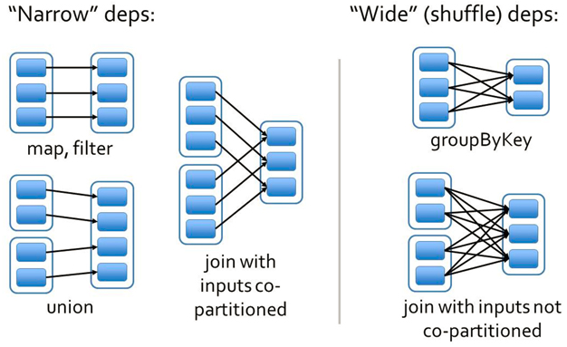

### Spark 容错机制

> Spark 中容错机制有 数据检查点 和 记录数据的更新

[参考链接](https://www.jianshu.com/p/99ebcc7c92d3)

[参考链接](https://blog.csdn.net/houmou/article/details/52531205)

一般来说，分布式数据集的容错性有两种方式：==数据检查点和记录数据的更新==

面向大规模数据分析，数据检查点操作成本很高，需要通过网络复制大量的数据集。

因此，Spark 采用==记录数据的更新的方式（体现在血统上面）==（也配合使用检查点 checkpoint 机制），但是更新粒度太细太多，那么记录更新成本也不低。

因此，RDD 只支持粗粒度转换，即只记录单个块上执行的单个操作，然后将创建的RDD的一系列变换序列记录下来。（每个RDD都包含了，它是如何由其他RDD变换过来的，以及如何重建某一==分区==的数据信息。因此RDD的容错机制又称为“血统”）

Lineage本质上很类似于数据库中的重做日志（Redo Log），只不过这个重做日志粒度很大，是对全局数据做同样的重做进而恢复数据。 

---

### Lineage 机制 

#### Lineage 简介

相比其他系统的细粒度的内存数据更新级别的备份或者LOG机制，RDD的 Lineage 记录的是粗粒度的特定数据Transformation操作（==如 filter，map，join 等==）行为。当这个RDD的部分分区数据丢失时，它可以通过Lineage获取足够信息来重新的运算和恢复失去的数据分区。因为这种粗颗粒的数据模型，限制了Spark的运用场合，所以Spark并不适用于所有高性能要求的场景，但同时相比细颗粒度的数据模型，也带来了性能的提升。 

#### 两种依赖关系

依赖指的是，每一个RDD都依赖于上一个RDD。

在Spark中，依赖分为两种：窄依赖（Narrow Dependencies ）和宽依赖（Wide Dependencies ），源码中称为 Shuffle Dependencies ，用来解决数据容错的高效。

- 窄依赖就是，一个分区只有一个出去的箭头。一个父分区对应一个子分区
- 宽依赖就是，一个分区有多个出去的箭头。一个父分区对应多个子分区

##### 本质理解

根据父RDD分区是对应1个还是多个子RDD分区来划分==窄依赖（父分区对应一个子分区）==和==宽依赖（一个父分区对应多个子分区）==。

- 如果是宽依赖，则当容错重新计算父分区时，因为一个父分区对应多个子分区，那么实际上父分区里面只有部分数据是这个子分区的，所以就造成了冗余计算。
- 如果是窄依赖，则当容错重新计算父分区时，因为一个父分区对应一个子分区，那么父分区里面的数据都是这个子分区的，那么这个容错计算就是100%利用率

---

### 依赖关系的特性

第一，窄依赖可以在某个计算节点上直接通过计算父RDD的某块数据计算得到子RDD对应的某块数据；宽依赖则要等到父RDD所有数据都计算完成之后，并且父RDD的计算结果进行hash并传到对应节点上之后才能计算子RDD。
 第二，数据丢失时，对于窄依赖只需要重新计算丢失的那一块数据来恢复；对于宽依赖则要将祖先RDD中的所有数据块全部重新计算来恢复。（因为宽依赖，子分区大多依赖于所有的父分区）

所以在长“血统”链特别是有宽依赖的时候，需要在适当的时机设置数据检查点。也是这两个特性要求对于不同依赖关系要采取不同的==任务调度机制==和 ==容错恢复机制==

 

 ### 容错原理

在窄依赖中，如果有一个子分区坏了，那么就需要重新父分区就行了，因为窄依赖，一个父分区对应一个子分区。父分区中的数据都是这个子分区的，所以计算利用率就是100%

在宽依赖中，如果有一个子分区坏了，那么就需要计算所有的父分区（大多数宽依赖，一个子分区依赖所有的父分区），而且每个父分区里面的数据，对应着多个子分区，那么就会有冗余计算。

---

### Checkpoint 机制

> Checkpoint 一般是存在HDFS里面（高可用）

通过上述的分析，可以看出，当计算流程DAG特别长以及很多宽依赖的适合使用检查点。

==checkpoint的意思就是建立检查点,类似于快照,例如在spark计算里面 计算流程DAG特别长,服务器需要将整个DAG计算完成得出结果,但是如果在这很长的计算流程中突然中间算出的数据丢失了,spark又会根据RDD的依赖关系从头到尾计算一遍,这样子就很费性能==当然我们可以将中间的计算结果通过cache或者persist放到内存或者磁盘中,但是这样也不能保证数据完全不会丢失,存储的这个内存出问题了或者磁盘坏了,也会导致spark从头再根据RDD计算一遍,所以就有了checkpoint,其中checkpoint的作用就是将DAG中比较重要的中间数据做一个检查点将结果存储到一个高可用的地方(通常这个地方就是HDFS里面) 

 ==当某个RDD的数据丢失了，我们可以不需要从它的父RDD重新计算，我们只需要找一个最近的checkpoint就可以，从最近的checkpoint里面读取数据==