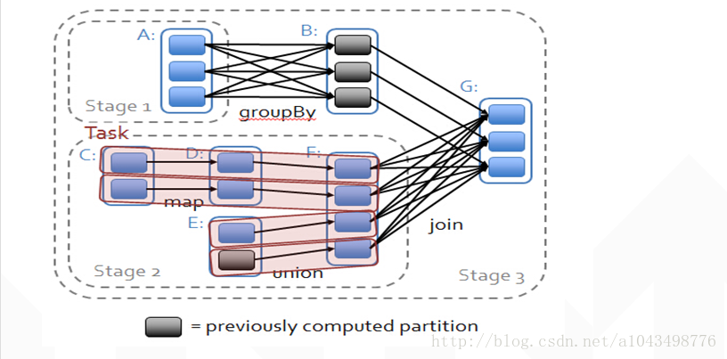

### Stage

Spark 会根据RDD之间的依赖关系，形成一个有向无环图 DAG，DAG会提交给 DAGScheduler，DAGScheduler会把DAG划分为相互依赖的多个Stage。

划分Stage的依据是根据RDD之间的宽窄依赖，遇到宽依赖就划分Stage，遇到窄依赖，这个RDD加入当前的Stage。每个Stage包含一个或多个Task任务，然后将这些Task以TaskSet形式提交给TaskScheduler运行。

==Stage是由一组并行的Task组成。==

> Stage 切割规则

从子RDD往父RDD（从后往前），遇到宽依赖就切割Stage，遇到窄依赖，就把这个RDD加入当前的Stage。

最外层有一个最大的Stage

